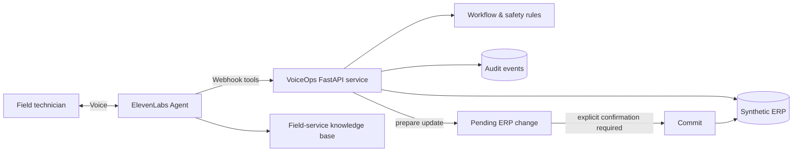

# VoiceOps Agent

**A governed voice-to-ERP field-service agent built with ElevenLabs.**

VoiceOps explores a practical enterprise question: **can a voice agent become a reliable interface to an operational workflow, not just a conversational demo?**

The scenario is inspired by a real field-service automation problem: a technician finishes an intervention and reports what happened by voice. The agent retrieves the intervention context, asks only for missing information, checks business and safety rules, prepares a structured ERP update, and requires explicit confirmation before any write action.

> Portfolio project. All customers, interventions, documents and business data in this repository are synthetic.

## What makes the demo interesting

This is deliberately not a generic FAQ or booking bot. The agent is designed around the constraints that make enterprise AI difficult:

- **Voice-to-action:** conversation drives real tool calls and structured workflow state.
- **Context-aware discovery:** the agent retrieves existing ERP context before asking questions.
- **Progressive data collection:** it asks only for information that is still required.
- **Safety escalation:** ambiguous electrical/safety situations must be escalated rather than guessed.
- **Human confirmation:** write operations are separated into `prepare` and `commit`; no ERP mutation can occur without explicit confirmation.
- **Auditability:** tool calls and workflow decisions are traceable.
- **Evaluation:** success is measured through task completion, correct tool selection, required-field coverage and safe-write behavior.

## Target conversation

A technician can say something like:

> “Intervention WO-18342. Leak under the sink, water supply isolated. Cabinet damaged, no visible electrical damage. Photos taken. The trap probably needs replacement and we may need a carpenter visit.”

VoiceOps should then:

1. retrieve `WO-18342` from the mock ERP;
2. identify missing mandatory fields;
3. ask focused follow-up questions;
4. detect safety-sensitive or contradictory information;
5. prepare a structured ERP payload;
6. summarize the proposed update to the technician;
7. require explicit confirmation;
8. commit the update only after confirmation;
9. return an auditable completion result.

## Architecture

The backend intentionally separates **read**, **decision**, **prepare**, and **commit** operations. The LLM never receives an unrestricted “update ERP” tool.

## Planned ElevenLabs integration

VoiceOps is designed to use current ElevenLabs Agents capabilities:

- webhook tools for server-side ERP operations;
- a knowledge base for procedures and business rules;
- automated simulation and tool-call tests;
- optional client tools for UI feedback;
- conversation-level evaluation criteria.

## Success criteria

The demo will track:

| Metric | Target |
| --- | --- |
| Required-field completion | 100% before prepare |
| Unconfirmed ERP writes | 0 |
| Safety-sensitive cases escalated | 100% in test scenarios |
| Correct tool sequence | Pass automated tool-call tests |
| Happy-path task completion | Pass end-to-end simulation |

## Repository roadmap

- [x] Define use case and architecture
- [x] Implement synthetic ERP + governed FastAPI tools (5 scenarios: happy path, missing fields, electrical risk, conflicting data, simulated backend failure)
- [x] Add automated backend tests (22 tests: retrieval, validation, safety escalation, transactions)
- [ ] Add knowledge base and versioned system prompt
- [ ] Configure ElevenLabs agent and webhook tools
- [ ] Add ElevenLabs simulation/tool-call tests
- [ ] Deploy the API
- [ ] Add a lightweight operator UI and 2-minute demo
- [ ] Document evaluation results

## Why this project

The most valuable enterprise AI systems sit between business process understanding, solution architecture, integration and production reliability. VoiceOps is a small, inspectable example of that intersection: **turning natural conversation into a controlled business action with measurable outcomes.**
