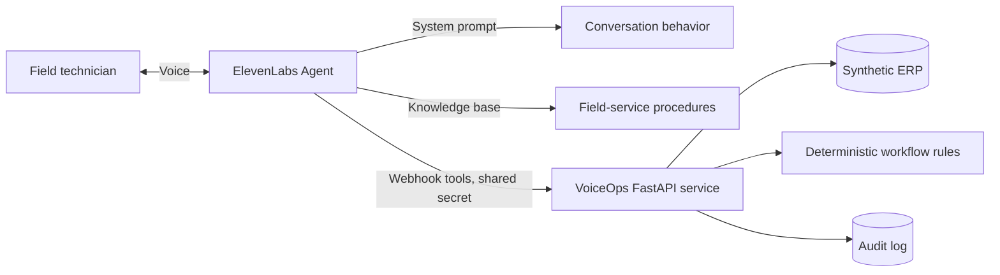
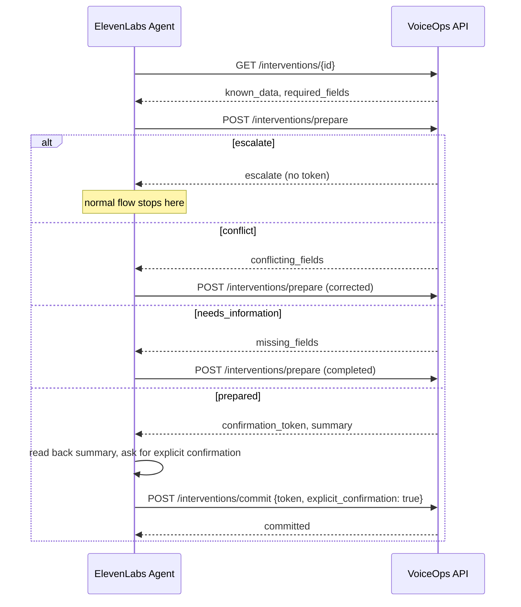

# Architecture

## Overview



Three layers, three different jobs:

| Layer | Responsibility | Can it block a write? |
| --- | --- | --- |
| System prompt (`prompts/system_prompt.md`) | Conversation behavior: what to ask, when to summarize, when to ask for confirmation | No -- advisory only |
| Knowledge base (`knowledge/`) | Business/domain knowledge: checklists, what counts as electrical risk, evidence requirements | No -- advisory only |
| Backend (`app/`) | Mandatory-field validation, safety escalation, conflict detection, transaction lifecycle | **Yes -- authoritative** |

The agent can misunderstand a technician, an LLM can be prompted around, but
the backend cannot be talked into skipping a required field, missing an
electrical-risk escalation, or committing an update without a valid,
unexpired, single-use, explicitly-confirmed token. That separation is the
core design decision of this project.

## Module layout

```
app/
  main.py               FastAPI app, router wiring, startup warning
  config.py              Env-driven settings (webhook secret, token TTL)
  models.py               Pydantic request/response/domain models
  security.py              Shared-secret webhook auth dependency
  services/
    erp.py                 Synthetic ERP store (5 scenarios)
    workflow.py             Mandatory-field / conflict / escalation / transaction logic
    audit.py                  Audit log
  routes/
    interventions.py          get / prepare / commit endpoints
    audit.py                    Read-only audit endpoint
```

`services/workflow.py` is intentionally the only place that decides
`prepared` / `needs_information` / `escalate` / `conflict`. Routes are thin;
they translate HTTP in and out but make no business decisions.

## Transaction lifecycle



Key properties enforced by `workflow.py`, independent of what the agent
does:

- A token is created only when every required field is present, no
  conflicts exist, and electrical risk is not `possible`/`confirmed`.
- A token expires after `VOICEOPS_TOKEN_TTL_SECONDS` (default 300s) and is
  deleted on first use -- it cannot be replayed.
- Preparing a corrected update immediately invalidates any earlier pending
  token for the same intervention (`prepare_invalidated_previous`), so a
  stale token from before a correction can never be committed.
- `commit` requires `explicit_confirmation: true` in the request body; the
  agent's prompt is the only thing standing between an ambiguous "I guess
  so" and that boolean, which is why the prompt is explicit about it -- but
  even a prompt failure only produces a 409, not a write.

## Security

Webhook endpoints accept an optional shared-secret header
(`X-VoiceOps-Secret`, configured via `VOICEOPS_WEBHOOK_SECRET`). This is a
proportionate control for a server-to-server webhook integration -- not a
substitute for a real auth system, which this project deliberately does not
build (see brief: "do not over-engineer identity/authentication"). `/health`
is intentionally unauthenticated so it can serve as a platform health check.

## Why not a generic "update ERP" tool

A single unrestricted write tool would let the LLM decide, on its own
judgment, when data is complete and safe to save. Splitting `prepare`
(validate + stage) from `commit` (the only mutating call, gated by a token
the LLM cannot fabricate) means the worst a prompt failure can do is fail to
prepare an update -- it can never produce an unconfirmed or unsafe write.
